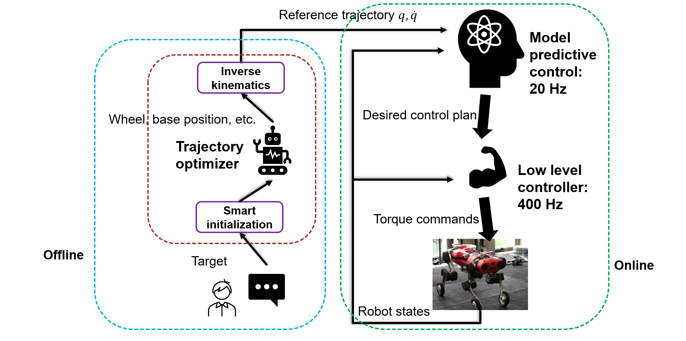

#### Learning sampling based exploration planning

#### Learning to Walk over structured terrains by Imitating MPC

 We propose to traverse structured obstacles with Imitation Learning via leveraging the knowledge from Model Predictive Control (MPC) expert. MPC can provide accurate solution given the perfect perception information in simulation, and we benefit from sample efficiency and improved constraints satisfaction by extending MPC-Net.
[|PDF|]()[|VIDEO|]()

#### MPC-feedback Trajectory Optimization for Wheeled-legged Robots

We propose to achieve the complex locomotion of wheeled robots in two step: First, trajectory libraries handling different terrains are generated offline; Second, Model Predictive Control (MPC) is used to track the trajectory. When deployed, the user can give command based on the terrain.
[|PDF|]()[|VIDEO|]()

