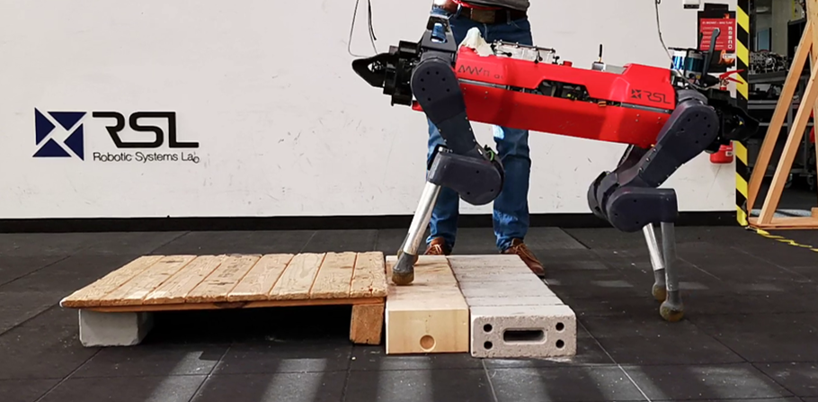

### learning sampling  based exploration planning

### Learning to walk over structured terrains by Imitating MPC

We propose to traverse structured obstacles with Imitation Learning via leveraging the knowledge from MPC expert. MPC can provide accurate solution given the perfect perception information in simulation, and we benefit from sample efficiency and improved constraints satisfaction by extending MPC-Net.
[|PDF|](../assets/pdfs/Learning_to_Walk_over_Structured_Terrains_by_Imitating_MPC.pdf)[|Video|]()

